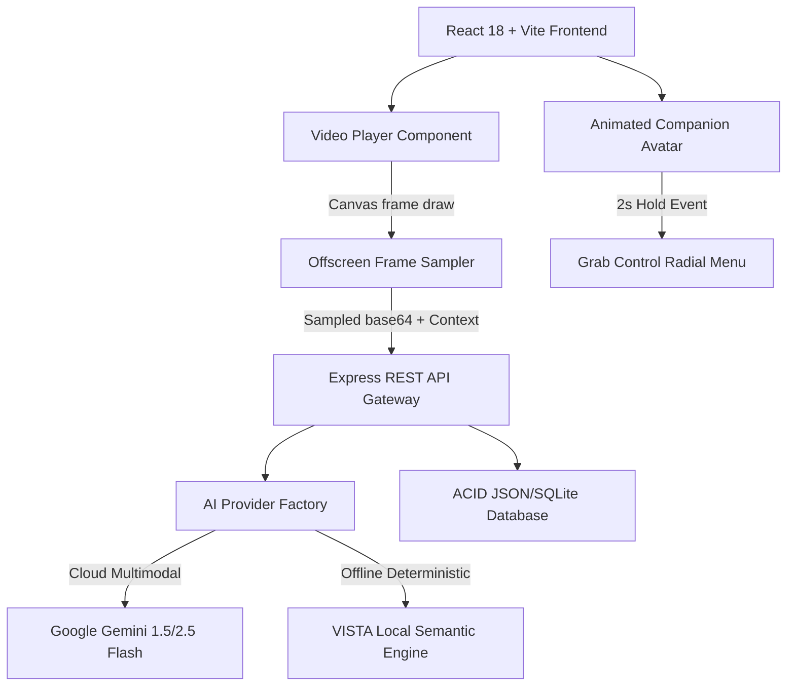
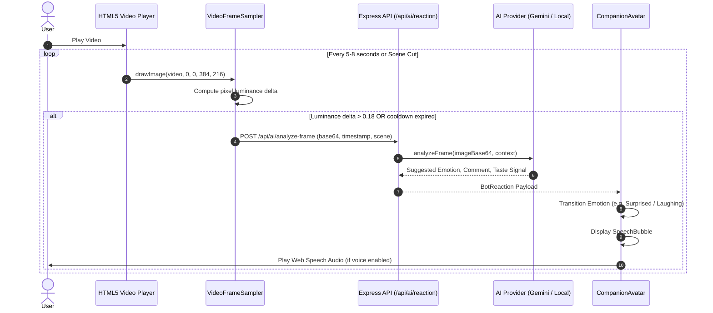
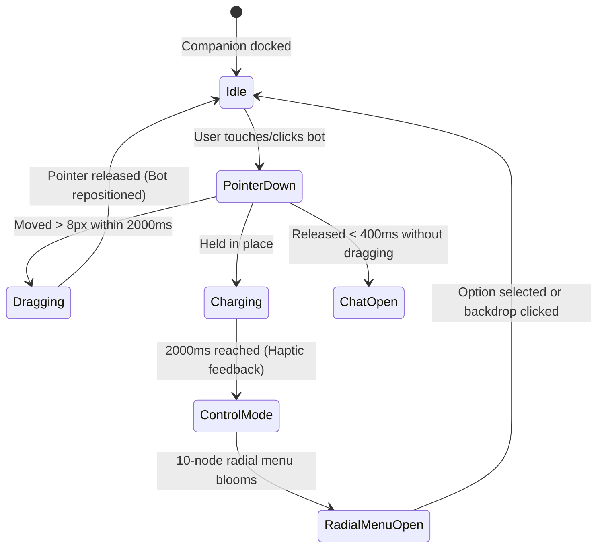
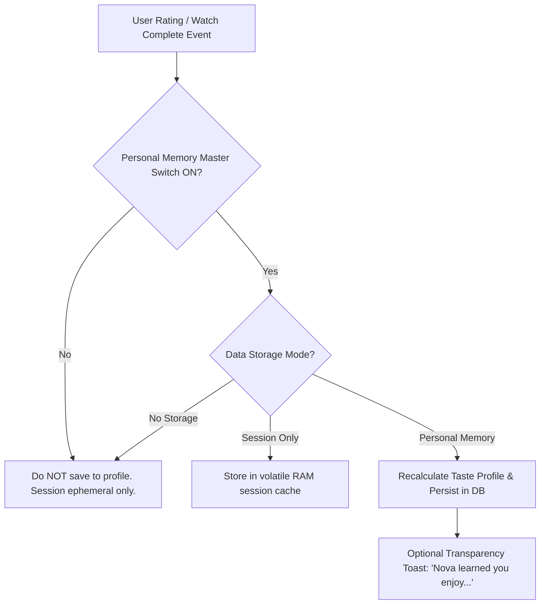

# VISTA System Architecture & Interaction Diagrams

## 1. System Topology Overview

---

## 2. Asynchronous Frame Sampling & Reaction Lifecycle

---

## 3. Physical "Grab the Bot" 2-Second Hold Detection

---

## 4. Sovereign Memory & Privacy Gatekeeper

